<p align="center">
    
</p>

# kb. A minimalist knowledge base manager


[](https://travis-ci.com/gnebbia/kb)
[](https://xscode.com/gnebbia/kb)

#### You can get support for kb [here](https://xscode.com/gnebbia/kb)

Author: gnc <nebbionegiuseppe@gmail.com>

Copyright: © 2020, gnc

Date: 2020-10-16

Version: 0.1.5


## Table of Contents

   * [Purpose](#purpose)
   * [Installation](#installation)
      * [Installation with homebrew](#installation-with-homebrew)
      * [Notes for Windows users](#notes-for-windows-users)
   * [Docker](#docker)
   * [Usage](#usage)
      * [List artifacts](#list-artifacts)
         * [List all artifacts contained in the kb knowledge base](#list-all-artifacts-contained-in-the-kb-knowledge-base)
         * [List all artifacts containing the string "zip"](#list-all-artifacts-containing-the-string-zip)
         * [List all artifacts belonging to the category "cheatsheet"](#list-all-artifacts-belonging-to-the-category-cheatsheet)
         * [List all the artifacts having the tags "web" or "pentest"](#list-all-the-artifacts-having-the-tags-web-or-pentest)
         * [List using "verbose mode"](#list-using-verbose-mode)
      * [Add artifacts](#add-artifacts)
         * [Add a file to the collection of artifacts](#add-a-file-to-the-collection-of-artifacts)
         * [Add a file to the artifacts](#add-a-file-to-the-artifacts)
         * [Add all files contained in a directory to kb](#add-all-files-contained-in-a-directory-to-kb)
         * [Create a new artifact from scratch](#create-a-new-artifact-from-scratch)
      * [Delete artifacts](#delete-artifacts)
         * [Delete an artifact by ID](#delete-an-artifact-by-id)
         * [Delete multiple artifacts by ID](#delete-multiple-artifacts-by-id)
         * [Delete an artifact by name](#delete-an-artifact-by-name)
      * [View artifacts](#view-artifacts)
         * [View an artifact by id](#view-an-artifact-by-id)
         * [View an artifact by name](#view-an-artifact-by-name)
         * [View an artifact without colors](#view-an-artifact-without-colors)
         * [View an artifact within a text-editor](#view-an-artifact-within-a-text-editor)
      * [Edit artifacts](#edit-artifacts)
         * [Edit an artifact by id](#edit-an-artifact-by-id)
         * [Edit an artifact by name](#edit-an-artifact-by-name)
      * [Grep through artifacts](#grep-through-artifacts)
         * [Grep through the knowledge base](#grep-through-the-knowledge-base)
         * [Grep (case-insensitive) through the knowledge base](#grep-case-insensitive-through-the-knowledge-base)
         * [Grep in "verbose mode" through the knowledge base](#grep-in-verbose-mode-through-the-knowledge-base)
      * [Import/Export/Erase a knowledge base](#importexporterase-a-knowledge-base)
         * [Export the current knowledge base](#export-the-current-knowledge-base)
         * [Import a knowledge base](#import-a-knowledge-base)
         * [Erase the entire knowledge base](#erase-the-entire-knowledge-base)
      * [Manage Templates](#manage-templates)
         * [List available templates](#list-available-templates)
         * [Create a new template](#create-a-new-template)
         * [Delete a template](#delete-a-template)
         * [Edit a template](#edit-a-template)
         * [Add a template](#add-a-template)
         * [Change template for an artifact](#change-template-for-an-artifact)
         * [Apply a template to all artifacts of a category](#apply-a-template-to-all-artifacts-of-a-category)
         * [Apply a template to all artifacts having zip in their title](#apply-a-template-to-all-artifacts-having-zip-in-their-title)
         * [Apply a template to all artifacts having specific properties](#apply-a-template-to-all-artifacts-having-specific-properties)
      * [Integrating kb with other tools](#integrating-kb-with-other-tools)
         * [kb and rofi](#kb-and-rofi)
   * [UPGRADE](#upgrade)
   * [DONATIONS](#donations)
   * [COPYRIGHT](#copyright)


## Purpose

kb is a text-oriented minimalist command line knowledge base manager. kb
can be considered a quick note collection and access tool oriented toward
software developers, penetration testers, hackers, students or whoever
has to collect and organize notes in a clean way.  Although kb is mainly
targeted on text-based note collection, it supports non-text files as well
(e.g., images, pdf, videos and others).

The project was born from the frustration of trying to find a good way
to quickly access my notes, procedures, cheatsheets and lists (e.g.,
payloads) but at the same time, keeping them organized.  This is
particularly useful for any kind of student. I use it in the context
of penetration testing to organize pentesting procedures, cheatsheets,
payloads, guides and notes.

I found myself too frequently spending time trying to search for that
particular payload list quickly, or spending too much time trying to find
a specific guide/cheatsheet for a needed tool. kb tries to solve this
problem by providing you a quick and intuitive way to access knowledge.

In few words kb allows a user to quickly and efficiently:

- collect items containing notes,guides,procedures,cheatsheets into
  an organized knowledge base;
- filter the knowledge base on different metadata: title, category,
  tags and others;
- visualize items within the knowledge base with (or without) syntax
  highlighting;
- grep through the knowledge base using regexes;
- import/export an entire knowledge base;

Basically, kb provides a clean text-based way to organize your knowledge.


## Installation

**You should have Python 3.6 or above installed.**

To install the most recent stable version of kb just type:
```sh
pip install -U kb-manager
```

If you want to install the bleeding-edge version of kb (that may have
some bugs) you should do:
```sh
git clone https://github.com/gnebbia/kb
cd kb
pip install -r requirements.txt
python setup.py install

# or with pip
pip install -U git+https://github.com/gnebbia/kb
```

**Tip** for GNU/Linux and MacOS users: For a better user experience,
also set the following kb bash aliases:
```sh
cat <<EOF > ~/.kb_alias
alias kbl="kb list"
alias kbe="kb edit"
alias kba="kb add"
alias kbv="kb view"
alias kbd="kb delete --id"
alias kbg="kb grep"
alias kbt="kb list --tags"
EOF
echo "source ~/.kb_alias" >> ~/.bashrc
source ~/.kb_alias
```

Please remember to upgrade kb frequently by doing:
```sh
pip install -U kb-manager
```

### Installation with homebrew

To install using homebrew, use:
```sh
brew tap gnebbia/kb https://github.com/gnebbia/kb.git
brew install gnebbia/kb/kb
```

To upgrade with homebrew:
```sh
brew update
brew upgrade gnebbia/kb/kb
```

### Installation from AUR

Arch Linux users can install [python-kb](https://aur.archlinux.org/packages/python-kb) or [python-kb-git](https://aur.archlinux.org/packages/python-kb-git) with their favorite [AUR Helper](https://wiki.archlinux.org/index.php/AUR_helpers).

Stable:
```sh
yay -S python-kb
```

Dev:
```sh
yay -S python-kb-git
```

### Notes for Windows users

Windows users should keep in mind these things:
- DO NOT USE notepad as %EDITOR%, kb is not compatible with notepad,
  a reasonable alternative is notepad++;
- %EDITOR% variable should ALWAYS be enclosed within double quotes;
```sh
EDITOR=C:\Program Files\Editor\my cool editor.exe      -> WRONG!
EDITOR="C:\Program Files\Editor\my cool editor.exe"    -> OK!
```

To set the "EDITOR" Environment variable by using cmd.exe, just issue
the following commands, after having inserted the path to your desired
text editor:
```sh
set EDITOR="C:\path\to\editor\here.exe"
setx EDITOR "\"C:\path\to\editor\here.exe\""
```

To set the "EDITOR" Environment variable by using Powershell, just issue
the following commands, after having inserted the path to your desired
text editor:
```sh
$env:EDITOR="C:\path\to\editor\here.exe"
[System.Environment]::SetEnvironmentVariable('EDITOR','"C:\path\to\editor\here.exe"', [System.EnvironmentVariableTarget]::User)
```

#### Setting Aliases for cmd

Open a cmd.exe terminal with administrative rights and paste
the following commands:
```sh
reg add "HKEY_LOCAL_MACHINE\Software\Microsoft\Command Processor" /v "AutoRun" /t REG_EXPAND_SZ /d "%USERPROFILE%\autorun.cmd"
(
echo @echo off
echo doskey kbl=kb list $*
echo doskey kbe=kb edit $*
echo doskey kba=kb add $*
echo doskey kbv=kb view $*
echo doskey kbd=kb delete --id $*
echo doskey kbg=kb grep $*
echo doskey kbt=kb list --tags $*
)> %USERPROFILE%\autorun.cmd
```

#### Setting Aliases for Powershell

Open a Powershell terminal and paste the following commands:
```sh
@'
function kbl { kb list $args }
function kbe { kb edit $args }
function kba { kb add  $args }
function kbv { kb view $args }
function kbd { kb delete --id $args }
function kbg { kb grep $args }
function kbt { kb list --tags $args }
'@ >  $env:USERPROFILE\Documents\WindowsPowerShell\profile.ps1
```


## Docker

A docker setup has been included to help with development.

To install and start the project with docker:
```sh
docker-compose up -d
docker-compose exec kb bash
```

The container has the aliases included in its `.bashrc` so you can use
kb in the running container as you would if you installed it on the
host directly.  The `./docker/data` directory on the host is bound to
`/data` in the container, which is the image's working directly also.
To interact with the container, place (or symlink) the files on your host
into the `./docker/data` directory, which can then be seen and used in
the `/data` directory in the container.

## Usage

A quick demo of a typical scenario using kb:

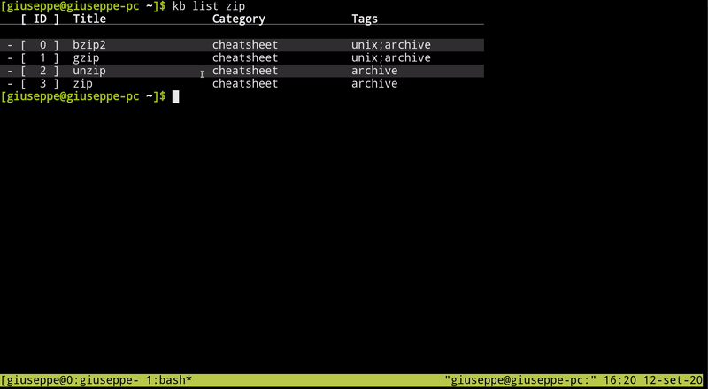

A quick demo with kb aliases enabled:

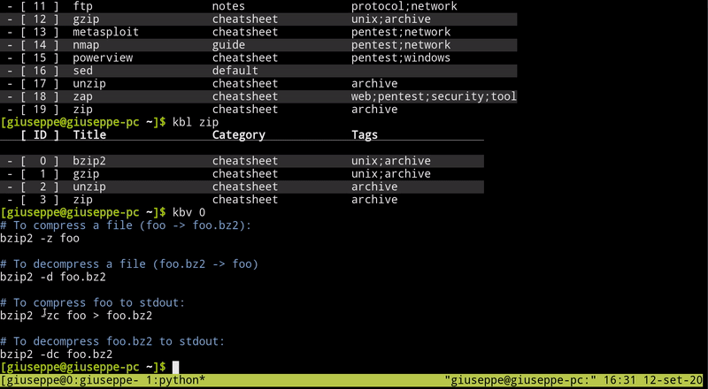

A quick demo for non-text documents:

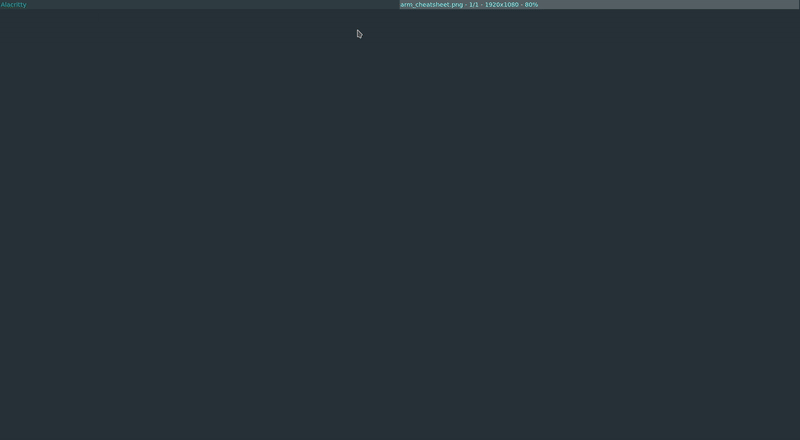

### List artifacts

#### List all artifacts contained in the kb knowledge base
```sh
kb list

# or if aliases are used:
kbl
```


#### List all artifacts containing the string "zip"
```sh
kb list zip

# or if aliases are used:
kbl zip
```


#### List all artifacts belonging to the category "cheatsheet"
```sh
kb list --category cheatsheet
# or
kb list -c cheatsheet

# or if aliases are used:
kbl -c cheatsheet
```
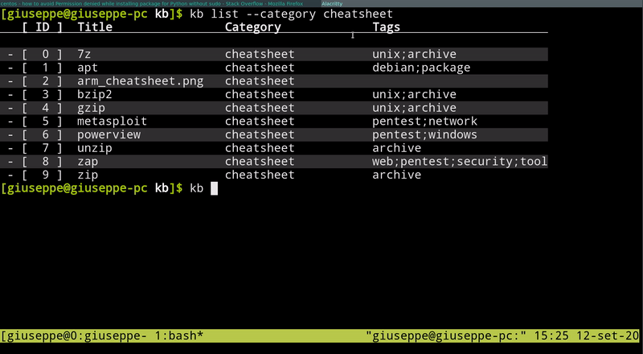

#### List all the artifacts having the tags "web" or "pentest"
```sh
kb list --tags "web;pentest"

# or if aliases are used:
kbl --tags "web;pentest"
```
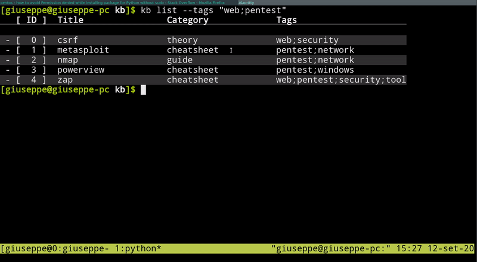

#### List using "verbose mode"
```sh
kb list -v

# or if aliases are used:
kbl -v
```
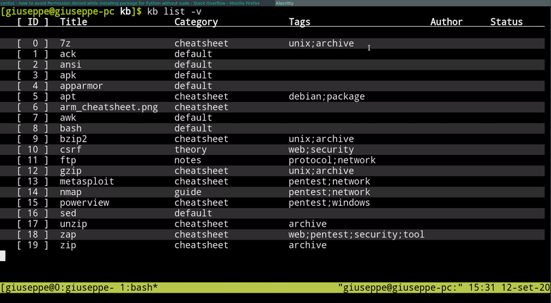


### Add artifacts

#### Add a file to the collection of artifacts
```sh
kb add ~/Notes/cheatsheets/pytest

# or if aliases are used:
kba ~/Notes/cheatsheets/pytest
```
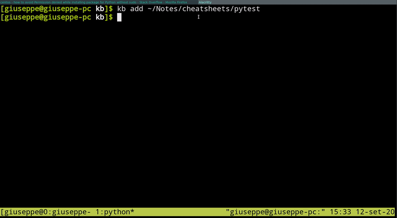

#### Add a file to the artifacts
```sh
kb add ~/ssh_tunnels --title pentest_ssh --category "procedure" \
    --tags "pentest;network" --author "gnc" --status "draft"
```
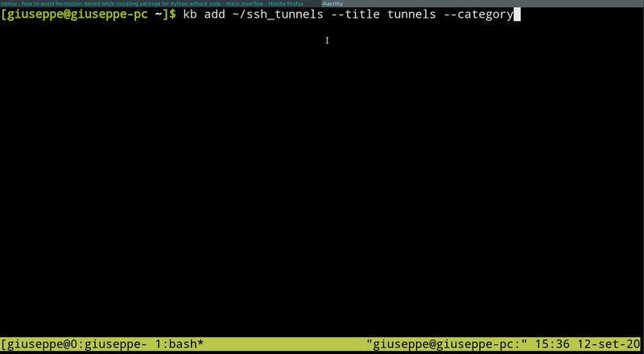

#### Add all files contained in a directory to kb
```sh
kb add ~/Notes/cheatsheets/general/* --category "cheatsheet"
```


#### Create a new artifact from scratch
```sh
kb add --title "ftp" --category "notes" --tags "protocol;network"
# a text editor ($EDITOR) will be launched for editing
```
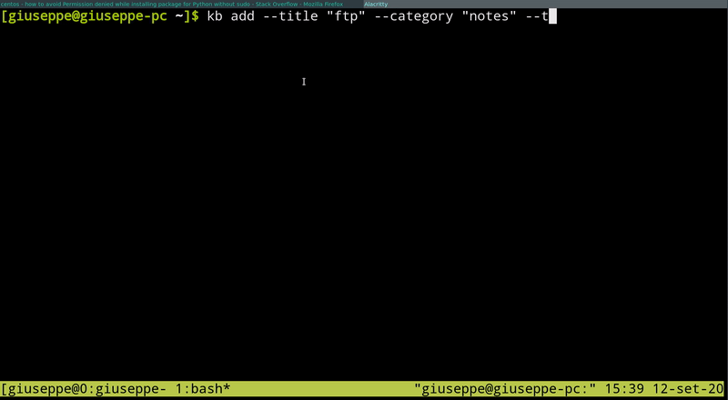

### Delete artifacts

#### Delete an artifact by ID
```sh
kb delete --id 2

# or if aliases are used:
kbd 2
```

#### Delete multiple artifacts by ID
```sh
kb delete --id 2 3 4

# or if aliases are used:
kbd 2 3 4
```


#### Delete an artifact by name
```sh
kb delete --title zap --category cheatsheet
```
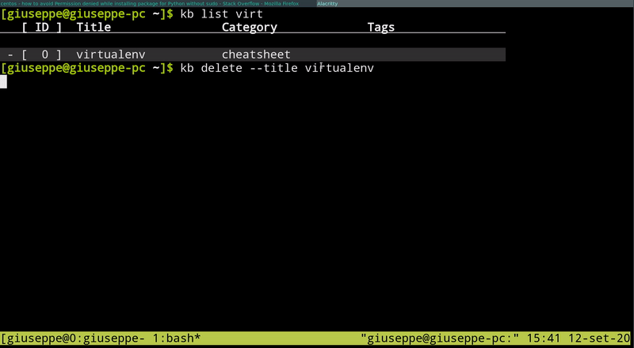


### View artifacts

#### View an artifact by id
```sh
kb view --id 3
# or
kb view -i 3
# or 
kb view 3

# or if aliases are used:
kbv 3
```
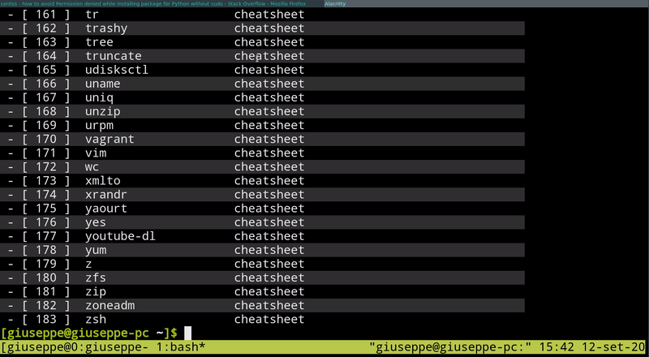

#### View an artifact by name
```sh
kb view --title "gobuster"
# or
kb view -t "gobuster"
# or
kb view gobuster
```
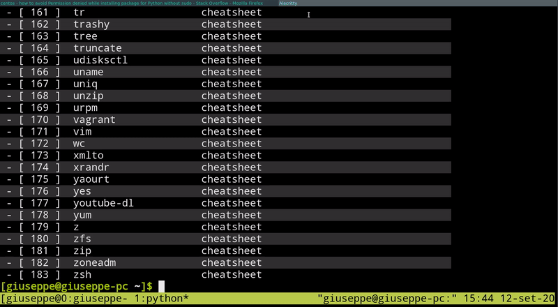

#### View an artifact without colors
```sh
kb view -t dirb -n
```
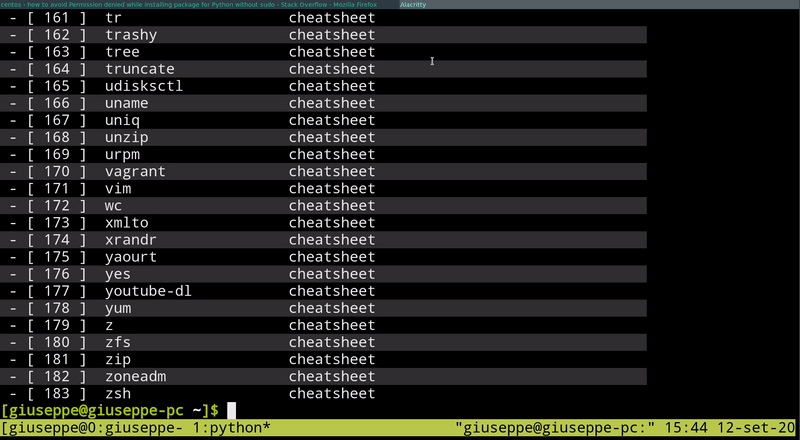

#### View an artifact within a text-editor
```sh
kb view -i 2 -e

# or if aliases are used:
kbv 2 -e
```


### Edit artifacts

Editing artifacts involves opening a text editor.
Hence, binary files cannot be edited by kb.

The editor can be set by the "EDITOR" environment
variable.

#### Edit an artifact by id
```sh
kb edit --id 13
# or
kbe 13
# or if aliases are used:
kbe 13 
```
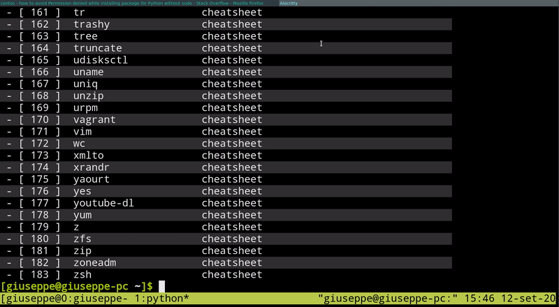

#### Edit an artifact by name
```sh
kb edit --title "git" --category "cheatsheet"
# or
kb edit -t "git" -c "cheatsheet"
# or if git is unique as artifact
kb edit git
```

### Grep through artifacts

#### Grep through the knowledge base
```sh
kb grep "[bg]zip"

# or if aliases are used:
kbg "[bg]zip"
```
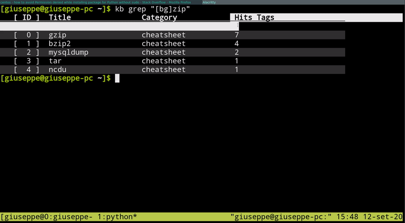

#### Grep (case-insensitive) through the knowledge base
```sh
kb grep -i "[BG]ZIP"
```


#### Grep in "verbose mode" through the knowledge base
```sh
kb grep -v "[bg]zip"
```

### Import/Export/Erase a knowledge base

#### Export the current knowledge base

To export the entire knowledge base, do:
```sh
kb export
```
This will generate a .kb.tar.gz archive that can
be later be imported by kb.


If you want to export only data (so that it can be used in other software):

```sh
 kb export --only-data
```

This will export a directory containing a subdirectory for each category
and within these subdirectories we will have all the artifacts belonging
to that specific category.

#### Import a knowledge base
```sh
kb import archive.kb.tar.gz
```
**NOTE**: Importing a knowledge base erases all the previous
data. Basically it erases everything and imports the new knowledge base.
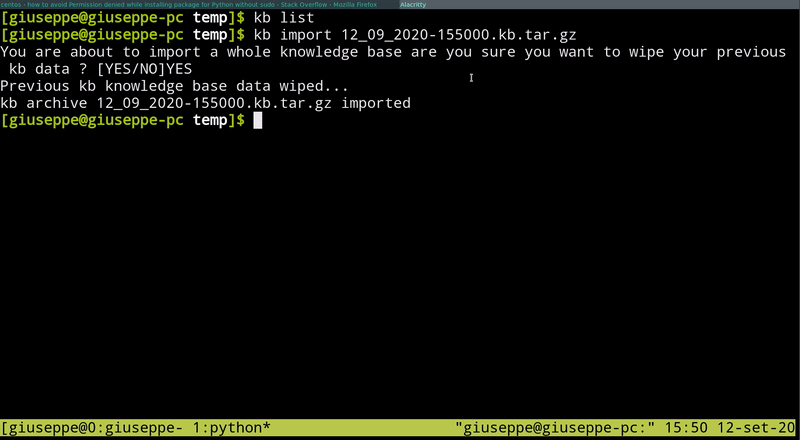

#### Erase the entire knowledge base
```sh
kb erase
```
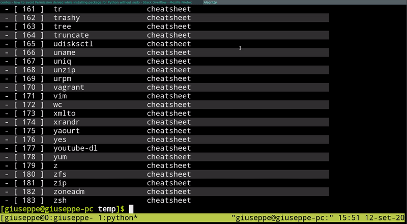


### Manage Templates

kb supports custom templates for the artifacts.
A template is basically a file using the "toml" format,
structured in this way:
```sh
TITLES   = [ "^#.*", "blue",  ]
WARNINGS = [ "!.*" , "yellow",]
COMMENTS = [ ";;.*", "green", ]
```

Where the first element of each list is a regex and the second element
is a color.

Note that by default an artifact is assigned with the 'default'
template, and this template can be changed too (look at "Edit a template"
subsection).


#### List available templates

To list all available templates:
```sh
kb template list
```

To list all the templates containing the string "theory":
```sh
kb template list "theory"
```

#### Create a new template

Create a new template called "lisp-cheatsheets", note that
an example template will be put as example in the editor.
```sh
kb template new lisp-cheatsheets
```

#### Delete a template

To delete the template called "lisp-cheatsheets" just do:
```sh
kb template delete lisp-cheatsheets
```

#### Edit a template

To edit the template called "listp-cheatsheets" just do:
```sh
kb template edit lisp-cheatsheets
```

#### Add a template

We can also add a template from an already existing toml configuration file
by just doing:
```sh
kb template add ~/path/to/myconfig.toml --title myconfig
```

#### Change template for an artifact

We can change the template for an existing artifact by ID by using the
update command:
```sh
kb update --id 2 --template "lisp-cheatsheets"
```

#### Apply a template to all artifacts of a category

We can apply the template "lisp-cheatsheets" to all artifacts
belonging to the category "lispcode" by doing:
```sh
kb template apply "lisp-cheatsheets" --category "lispcode"
```

#### Apply a template to all artifacts having zip in their title

We can apply the template "dark" to all artifacts having in their title
the string "zip" (e.g., bzip, 7zip, zipper) by doing:
```sh
kb template apply "dark" --title "zip" --extended-match
# or 
kb template apply "dark" --title "zip" -m
```
We can always have our queries to "contain" the string by using
the `--extended-match` option when using `kb template apply`.

#### Apply a template to all artifacts having specific properties

We can apply the template "light" to all artifacts of the category
"cheatsheet" who have as author "gnc" and as status "OK" by doing:
```sh
kb template apply "light" --category "cheatsheet" --author "gnc" --status "OK"
```

### Integrating kb with other tools

kb can be integrated with other tools.

#### kb and rofi

We can integrate kb with rofi, a custom mode has been developed
accessible in the "misc" directory within this repository.

We can launch rofi with this mode by doing:

```sh
rofi -show kb -modi kb:/path/to/rofi-kb-mode.sh
```


## UPGRADE

If you want to upgrade kb to the most recent stable release do:
```sh
pip install -U kb-manager
```

If instead you want to update kb to the most recent release 
(that may be bugged), do:
```sh
git clone https://github.com/gnebbia/kb 
cd kb
pip install --upgrade .
```

## DONATIONS

I am an independent developer working on kb in my free time,
if you like kb and would like to say thank you, buy me a beer!

[](https://paypal.me/nebbione)

## COPYRIGHT

Copyright 2020 Giuseppe Nebbione.

This program is free software: you can redistribute it and/or modify
it under the terms of the GNU General Public License as published by
the Free Software Foundation, either version 3 of the License, or
(at your option) any later version.

This program is distributed in the hope that it will be useful,
but WITHOUT ANY WARRANTY; without even the implied warranty of
MERCHANTABILITY or FITNESS FOR A PARTICULAR PURPOSE.  See the
GNU General Public License for more details.

You should have received a copy of the GNU General Public License
along with this program.  If not, see <http://www.gnu.org/licenses/>.
